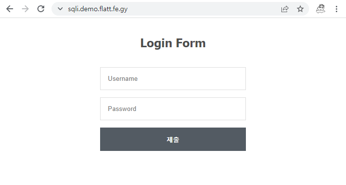

### Node.js Express + MySQL vulnerable boilerplate project



[[DEMO](https://sqli.demo.flatt.fe.gy/)]

The sourcecode is referenced from https://codeshack.io/basic-login-system-nodejs-express-mysql/

## Setup

All you need to do is to run docker-compose and check your http://localhost:3000/

Tested on Ubuntu Focal / Bionic.

```
$ docker-compose up --build -d
```

## Explanation / Demonstration Methods

* (English)
* (日本語)
* https://harold.kim/blog/2022/02/nodejs-mysql-vulnerability/ (한국어)

